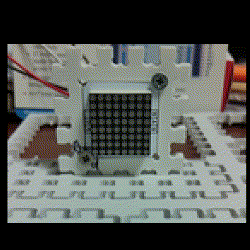

# Rust IS31FL3728 audio modulated matrix led driver

## Usage
Add the following to your Cargo.tml to get is a dependency (check that version is the latest!).
```toml
[dependency]
is31fl3728-rs="0.9.0"
```

## Controller support

This crate provides a platform-agnostic driver for the IS31FL3728 LED Matrix.
Led driver uses I2C.

Support all features of driver:

- ✅ Audio input with gain selection and audio frequency equalize 
- ✅ Array mode selection (8x8 dot matrix, 7x9, 6x10, 5x11)
- ✅ Intensity of the matrix output (from 5mA to 75mA with 5mA step)
- ✅ Software shutdown and return from it.

See IS31FL3728 data sheet for details.


## Crate's features
This crate based on [`embedded-hal`] version 1.0. 

 Features:
- `rtt` - enable debug output of communication between your app and led driver. 
>[!IMPORTANT]
> You MUST initialize rtt in your application

- `embedded-graphics` - enable support of [embedded-graphics](https://github.com/embedded-graphics/embedded-graphics). 
  See example 

## Crate's specifics
The IS31FL3728 uses columns, not rows, as the more popular MAX7219 does. 
This is why you can't use a 8x8 led matrix editor like this one: 
https://xantorohara.github.io/led-matrix-editor/ . 
The library provides a method "draw_bitmap" which solves this trouble.

### Instantiating
Create an instance of driver with the `new` method, by passing initialized I2C and configuration
```rust
let i2c = // depends of your MCU and HAL
let matrix_addr: u8 = 0x60;
let mut led_matrix = IS31FL3728::new(i2c, matrix_addr, MatrixDimensions::M8x8, false).unwrap();
```
Driver is ready to use after creating.

### Main methods

* `draw_column` - show column on the matrix
* `draw` - show several columns on the matrix. Use this method for quick update matrix.
* `draw_bitmap` - like `draw`, but elements in the array are rows. So you can easy use online led matrix editors
See more methods for full control. 

### Examples
Folder [examples](examples) contains full examples:
* [stm32](examples/stm32-f401RE) - tested on Nulceo-64 F401RE
* [embedded-graphics](examples/embedded-graphics/) - simple sprite's animation.


#### Quick code (STM32)

```rust
#![deny(unsafe_code)]
#![no_main]
#![no_std]


use is31fl3728_led_matrix::{LightingIntensity, MatrixDimensions, DEFAULT_LIGHTING_INTENSITY, IS31FL3728};

// Halt on panic
use panic_halt as _;

use rtt_target::rtt_init_print;

use cortex_m_rt::entry;
use stm32f4xx_hal::{self as hal, gpio::GpioExt, i2c::I2c, pac, prelude::*};

#[allow(clippy::empty_loop)]
#[entry]
fn main() -> ! {
    rtt_init_print!();

    let dp = pac::Peripherals::take().unwrap();

    let rcc = dp.RCC.constrain();
    let clocks = rcc.cfgr.use_hse(8.MHz()).sysclk(84.MHz()).freeze();
    let mut delay = dp.TIM5.delay_us(&clocks);      


    let gpiob = dp.GPIOB.split();

    let pb8_scl = gpiob.pb8;
    let pb9_sda = gpiob.pb9;

    // Initiation of I2C
    let i2c1 = I2c::new(
        dp.I2C1,
        (pb8_scl, pb9_sda),
        hal::i2c::Mode::standard(400.kHz()),
        &clocks,
    );

    let matrix_addr: u8 = 0x60;
    let mut led_matrix = IS31FL3728::new(i2c1, matrix_addr, MatrixDimensions::M8x8, false).unwrap();
    led_matrix.clear().unwrap();

    let picture = [
        0b00000000,
        0b01100110,
        0b11111111,
        0b11111111,
        0b11111111,
        0b01111110,
        0b00111100,
        0b00011000,
    ];

    led_matrix.draw_bitmap(&picture).unwrap();
    led_matrix.set_intensity(LightingIntensity::C20mA).unwrap();

    loop {
        led_matrix.software_on().unwrap();
        led_matrix.set_intensity(LightingIntensity::C10mA).unwrap();
        delay.delay_ms(150);
        led_matrix.set_intensity(LightingIntensity::C25mA).unwrap();
        delay.delay_ms(150);
        led_matrix.set_intensity(DEFAULT_LIGHTING_INTENSITY).unwrap();
        delay.delay_ms(500);

        led_matrix.set_intensity(LightingIntensity::C25mA).unwrap();
        delay.delay_ms(150);
        led_matrix.set_intensity(LightingIntensity::C10mA).unwrap();
        delay.delay_ms(150);
        led_matrix.software_shutdown().unwrap();
        delay.delay_ms(300);
    }
}
```

Result of application:



